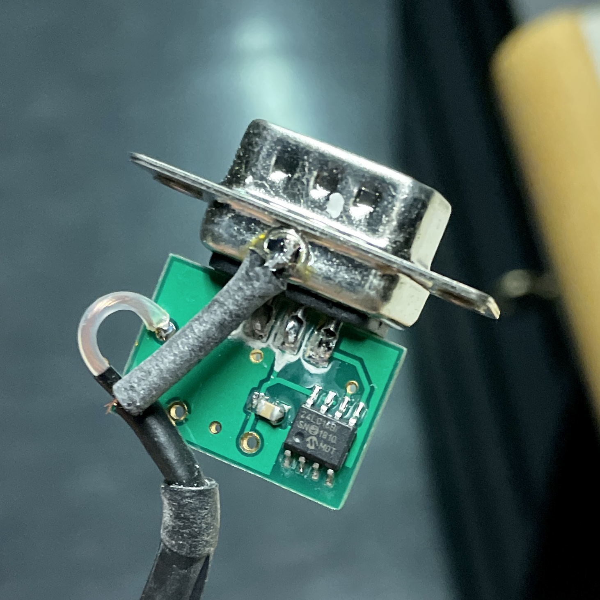

ProgramGODetector
=================

## Overview

A standalone command line app to modify data stored in detector heads for the optometer P-9710 by [Gigahertz-Optik GmbH](https://www.gigahertz-optik.com/) via its RS232 interface.

For use as optometer the P-9710 can be combined with a varity of detector heads intended for photometric and radiometric measurements. Gigahertz-Optik offers a wide range of detector heads for various measuring tasks. The calibration data of the detector heads are saved in the so called calibration data connector.

Technically the calibration data is stored using a 24LC16B (16 Kb I2C compatible serial EEPROM). This IC is located inside the 15 pin connector.



The detector to be updated must be conneted to a P-9710 optometer and this in turn to a computer via its serial interface. The parameters to modify must be supplied as command line options. The original detector settings are saved in the logfile as a memory dump.


## Command Line Usage

```
ProgramGODetector [options]
```

### Options

`--comment` : User supplied string to be included in the log file metadata.

`--port (-p)` : Serial port name.

`--logfile` : Log file name.

`--serialNumber (-s)` : Detector serial number.

`--calibrationFactor (-f)` : Calibration factor in A/unit.

`--unit (-u)` : Measurement unit (code).

`--name (-n)` : Detector name (4 characters at most).

`--customString (-c)` : Custom string (16 characters at most).


## Dependencies

Bev.Instruments.P9710.Detector: https://github.com/matusm/Bev.Instruments.P9710.Detector

CommandLineParser: https://github.com/commandlineparser/commandline 


